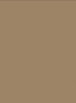
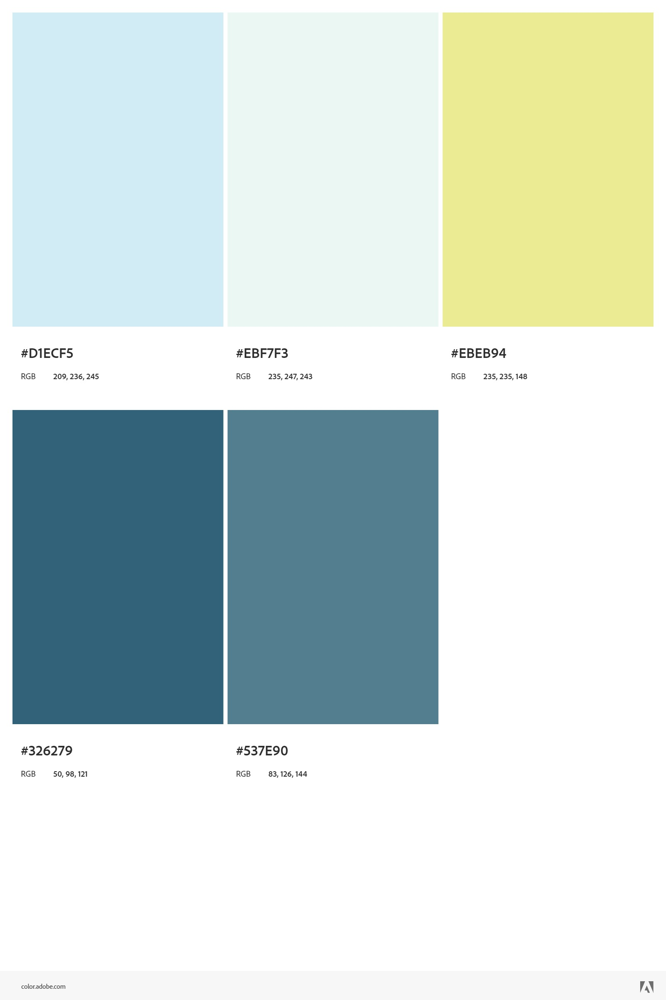
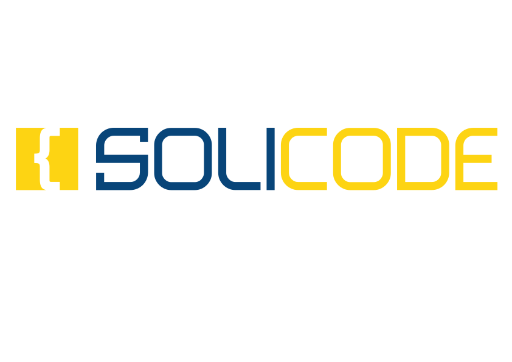
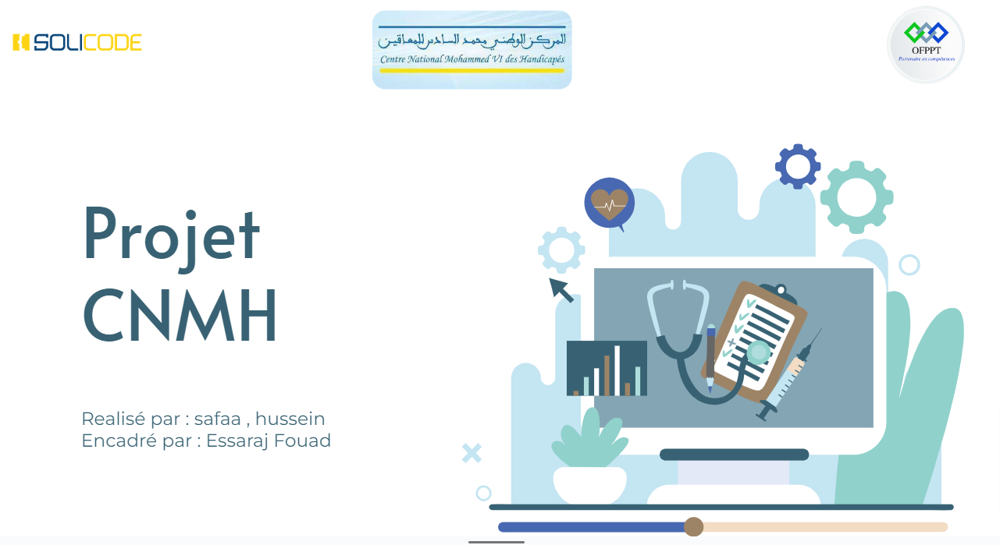

# La Charte Graphique

## Travail à Faire :
- Création de la charte graphique de présentation
- Appliquer la charte graphique dans le thème de la présentation
- Appliquer la charte graphique dans la présentation

## Palette de Couleurs du Logo

### Couleurs Principales
- Couleur Principale : `#C4E5F2`

### Couleurs Additionnelles (Basées sur la Règle de la Roue Chromatique)
- Couleur Complémentaire :
    - `#84A5B3`

    

    - `#F2DCC4`

    

    - `#386273`

    

    - `#9D8467`

    

### Règle de la Roue Chromatique
La palette de couleurs est générée en utilisant la règle Complémentaire de la Roue Chromatique.

## Référence
Utilisez la [Roue Chromatique](https://www.sessions.edu/color-calculator/) pour explorer les harmonies de couleurs.

## Note
Cette palette est conçue pour compléter les couleurs trouvées dans notre logo. N'hésitez pas à ajuster et expérimenter avec ces couleurs pour créer une présentation visuellement attrayante.

## Palette de Couleurs

## Logo

### Solicode

### CNMH

### OFPPT

# Branding du Centre Médical

## Famille de Polices
- **Montserrat**
- **Open Sans**
- Sans-Serif

## Référence
- [Police Montserrat](https://fonts.google.com/specimen/Montserrat)
- [Police Open Sans](https://fonts.google.com/specimen/Open+Sans)

## Note
Ces familles de polices, telles que Montserrat et Open Sans, sont recommandées pour le branding d'un centre médical. Elles offrent un aspect propre et professionnel, améliorant la lisibilité et transmettant un sentiment de confiance et de fiabilité.

### Références
Les références de couleurs peuvent être consultées sur [Adobe Color Themes](https://color.adobe.com/fr/My-Color-Theme-color-theme-5643d048-9e05-40a2-a5d2-5295a42aa663/).

### Note
Le fond de la présentation doit rester blanc en raison du diagramme UML.

# Thème de la Présentation

[Exemple slide](https://docs.google.com/presentation/d/1iipkAvkR68LQkmU8Gks_kWtWpdhh0VEgranMk800MWM/edit?usp=sharing)

