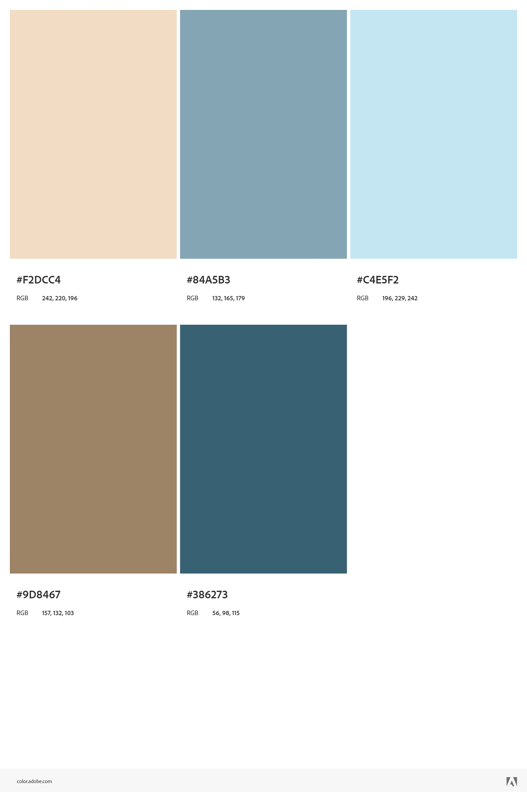

# Validation Branche fonctionnelle
## Travaille a faire :
- User storie 
- creation charte graphique de presentation  
-  Appliquer la charte graphique dans le theme de presentation 
- Appliquer  la charte graphique dans la presentation

# Rapport branche fonctionnelle
[branche fonctionnelle](https://docs.google.com/document/d/1ChcaLO0gb-rc4wh6fTCoORnpx5wyOrUke7OMOUXfbbQ/edit?usp=sharing)

# La Charte Graphique

## Logo

### solicode

### CNMH

### OFPPT

## Font-Family
- **Poppins**
- Sans-Serif

## Couleurs

- `#D1ECF5`

- `#EBF7F3`

- `#EBEB94`

- `#326279`

- `#537E90`

### Références
Les références de couleurs peuvent être consultées sur [Adobe Color Themes](https://color.adobe.com/fr/boom-color-theme-9a19b0ba-edea-435a-8b8c-62316972504c/).

### Note
Le fond de la présentation doit rester blanc en raison du diagramme UML.

# Theme Presentation

[Theme presentation](https://docs.google.com/presentation/d/1iipkAvkR68LQkmU8Gks_kWtWpdhh0VEgranMk800MWM/edit?usp=sharing)

## Logo image
[All used logos](https://docs.google.com/document/d/1WfMe91BvddGaOmxz0usR-dpOietgO5iYy1aYWl-gw2s/edit?usp=sharing)
